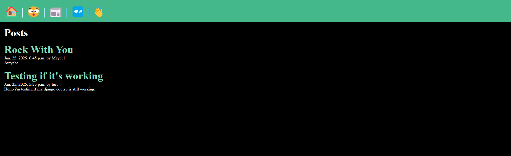

<a id="readme-top"></a>
<!-- PROJECT LOGO -->
<br />
<div align="center">
  <a href="https://github.com/Acrazie" target="_blank">
    
  </a>

  <h3 align="center">DjangoCourses</h3>

  <p align="center">
    Tutoriel Django
    <br />
    <a href="https://github.com/Acrazie/Portfolio"><strong>Explore the docs »</strong></a>
    <br />
  </p>
</div>


<!-- TABLE OF CONTENTS -->
<details>
  <summary>Table of Contents</summary>
  <ol>
    <li>
      <a href="#about-the-project">About The Project</a>
      <ul>
        <li><a href="#built-with">Built With</a></li>
      </ul>
    </li>
    <li>
      <a href="#getting-started">Getting Started</a>
      <ul>
        <li><a href="#prerequisites">Prerequisites</a></li>
        <li><a href="#installation">Installation</a></li>
      </ul>
    </li>
    <li><a href="#contact">Contact</a></li>
  </ol>
</details>


<!-- ABOUT THE PROJECT -->
## About The Project

Pour un voir comment Django fonctionne, l'ORM est vraiment pas mal, le setup des apps et projects sont assez simples à mettre en place. En revanche le setup des fichiers est très difficile à prendre en main; c'est long, complexe.

En 4 mois je pense, qu'on peut commencer à faire de vrai bon projets avec Django, en comprends chaque models, settings, views, templates.

J'espère que vous aimez ! 😀

<p align="right">(<a href="#readme-top">back to top</a>)</p>


### Built With

<div align="center">
  
  
  
  
  
  
  
  
  
</div>

###

<p align="right">(<a href="#readme-top">back to top</a>)</p>

<!-- GETTING STARTED -->
## Getting Started

Suivez le guide d'installation et tout ira bien :)

### Prerequisites

Installer les extensions VSC suivantes :
- https://marketplace.visualstudio.com/items?itemName=batisteo.vscode-django
- https://marketplace.visualstudio.com/items?itemName=junstyle.vscode-django-support

Avoir Python d'installer.

### Installation

1. Clone the repo
   ```sh
   git@github.com:Acrazie/DjangoCourse.git
   ```

2. Open a folder like Lesson navigate to the root of the project
   ```sh
   cd myproject
   ```
 
3. When wanting to check a tutorial, activate the venv or env
   ```sh
   source venv/bin/activate
   ```
   
4. Start the project ( you should see a manage.py file)
   ```sh
   python manage.py runserver
   ```

<p align="right">(<a href="#readme-top">back to top</a>)</p>

<!-- CONTACT -->
## Contact

<br clear="both">

<p align="center">
  <a href="https://www.linkedin.com/in/mayeuld/" target="_blank"></a>&nbsp;&nbsp;
  <a href="https://linktr.ee/MayeulDBZ" target="_blank"></a>&nbsp;&nbsp;
</p>

###

<p align="right">(<a href="#readme-top">back to top</a>)</p>
